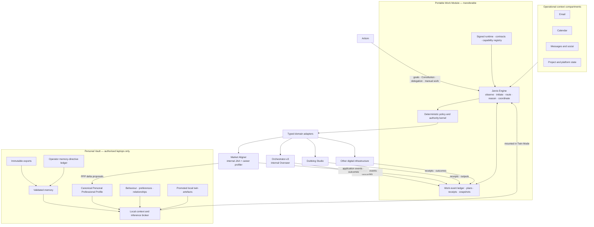

# GIGA / Jarvis sovereign architecture

This is the documentation-only home for the complete GIGA architecture map. It describes the
whole system: Jarvis as the persistent engine, the optional Personal Vault and digital-twin
payload, deterministic policy enforcement, routing, evidence and memory, autonomous initiative,
runtime continuity, and governed adapters to independently owned work systems.

## Documents

1. [`11_JARVIS_SOVEREIGN_RUNTIME_PROPOSED_ARCHITECTURE.md`](docs/11_JARVIS_SOVEREIGN_RUNTIME_PROPOSED_ARCHITECTURE.md)
   defines the end-state system, requirements, layers, ownership boundaries and architectural laws.
2. [`12_JARVIS_SOVEREIGN_RUNTIME_IMPLEMENTATION_BLUEPRINT.md`](docs/12_JARVIS_SOVEREIGN_RUNTIME_IMPLEMENTATION_BLUEPRINT.md)
   decomposes that map into independently useful implementation slices with prerequisites,
   verification gates, rollback rules and restart instructions.

## Architecture at a glance

[Open the detailed end-state operational flow](docs/11_JARVIS_SOVEREIGN_RUNTIME_PROPOSED_ARCHITECTURE.md#31-end-state-operational-flow).

## Scope and authority

This repository contains explanations and planning material only. It contains no runtime
implementation, Personal Vault contents, credentials, work state, deployment activation, or grant
of authority. The documents retain their own proposal and ratification status.

## Canonical source identities

- Proposed architecture SHA-256: `fc65e8221416178eb3c7ef2801b4e631269853926a648683648dc7cc293dc245`
- Implementation blueprint SHA-256: `eebb08490dcba120f793f4a5c513a71accefa0d4871c2b05f24d8d1d6a3ae6a8`
