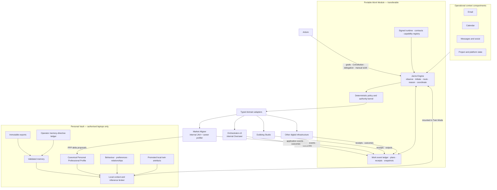
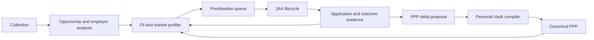

# Jarvis sovereign runtime — proposed architecture

**Status:** PROPOSED · UNRATIFIED · DESIGN ONLY  
**Date:** 2026-08-19  
**Authority:** none; this document grants no data access, execution authority, identity authority or deployment approval  
**Operator source:** explicit architecture requirements stated by Artiom on 18–19 August 2026  
**Relationship to canon:** proposed successor/refinement to `04_VIRTUAL_TWIN_TARGET.md`,
`05_TRANSITION_ROADMAP.md` and `10_DETERMINISTIC_EXECUTION_BOUNDARY.md`; those documents remain
authoritative until this proposal is ratified and reconciled through the existing lineage process

## Why this is a separate proposal

`04_VIRTUAL_TWIN_TARGET.md` is a registered historical target with existing content and source
hashes. Editing it in place would mix a new, unratified design with the current canonical baseline
and would make its existing receipts misleading. This file has a genuinely different lifecycle:
proposal → review → operator ratification or rejection → lineage reconciliation → staged
implementation. That separate lifecycle is why the canonical target cannot safely serve as the
working file for this redesign.

## Executive decision

Jarvis becomes the persistent autonomous engine for Artiom's digital infrastructure. It observes,
initiates, reasons, plans, routes, executes, verifies and persists without requiring a new human
prompt for every action. Jarvis can run in two principal autonomous modes:

1. **Faceless mode:** the Personal Vault is unavailable; Jarvis uses portable work state, operational
   compartments and a default behavioural profile.
2. **Twin mode:** the local Personal Vault is mounted; Jarvis may use Artiom's memory, professional
   profile, preferences, behavioural models and promoted voice/reasoning artefacts.

Jarvis is not the source of authority. Artiom remains the authority root and delegates bounded or
broad capabilities through versioned policy. A signed Constitution is cross-cutting and unavoidable:
it constrains boot, routing, context access, model use, tool use, external representation, state
mutation, self-update and receipt acceptance.

The architecture deliberately separates:

- a cloud-transferable **Portable Work Module**;
- a locally held **Personal Vault**;
- the persistent **Jarvis Engine**;
- compartmentalised but usable operational data such as email and calendar;
- independently owned domain systems controlled through typed adapters;
- deterministic policy, authority, state transition and receipt boundaries;
- probabilistic classification, reasoning, generation and inference.

## 1. Operator requirements ledger

These requirements are explicit operator statements, not inferences from writing style or project
history. Architecture decisions below cite their requirement IDs.

| ID | Operator requirement | Architectural consequence |
|---|---|---|
| R-01 | The work module must be strict, transferable, cloud-uploadable and restorable on any work device. | Runtime, mutable work state, secrets and personal data become separate deployment artefacts with a deterministic restore protocol. |
| R-02 | The Personal Module lives locally on authorised personal laptops and only Artiom has access. | Personal evidence, memory and twin artefacts live in a separately encrypted vault mounted through a local broker. |
| R-03 | Memory includes immutable raw exports. | Raw evidence is append-only/immutable and addressed by hashes; derived memory never replaces it. |
| R-04 | Literal commands about what to remember append to a ledger. | Operator memory directives are authenticated append-only events and are never silently rewritten or deleted. |
| R-05 | Exports should yield inferred memories such as temporally located events. | A knowledge compiler emits evidence-linked memory proposals with explicit time precision and provenance. |
| R-06 | Memory should expose low-confidence, inferred and certain tiers. | The UI presents those three tiers while storage separates epistemic class, confidence and review state to avoid category errors. |
| R-07 | Local models should learn speech, reasoning/thinking and preference patterns. | The vault stores separate voice, preference and cognitive artefacts, each versioned and promotion-gated against a base+retrieval baseline. |
| R-08 | Jarvis is the engine; the digital twin is information/training, not the always-on worker. | Persistence, initiative and execution live in Jarvis. The twin is an optional mounted context/model payload. |
| R-09 | Jarvis must operate autonomously without the Personal Vault. | Faceless mode retains operational compartments, default reasoning, work goals and domain authority. |
| R-10 | With the Personal Vault, Jarvis should behave as a digital version of Artiom. | Twin mode mounts personal context and promoted behavioural artefacts without changing the invariant policy path. |
| R-11 | Jarvis must initiate work because it determines that the work advances Artiom's goals. | A first-class initiative engine produces typed self-initiated stimuli with `why_now`, goal and evidence links. |
| R-12 | Jarvis should control Orchestrator-v3, Market Aligner, Dubbing Studio and other work systems. | Domain systems expose typed capability adapters; Jarvis coordinates them without sharing their internal databases. |
| R-13 | Jarvis should survive being left on for approximately six years. | Multi-year continuity requires supervision, fencing, external heartbeat, durable replay, restore, updates, rollback and degraded operation. |
| R-14 | Jarvis should represent Artiom online and pass a private "Artiom Test" with his voice. | Identity representation becomes a capability family; fidelity is measured across voice, memory, decisions, initiative and longitudinal consistency. |
| R-15 | Vault connection represents accepted privacy risk. | Twin mode may use broad vault context once locally authorised; the design retains integrity, provenance and access auditing rather than pretending the risk is absent. |
| R-16 | Email and similar sources remain usable when the vault is disconnected, but compartmentalised. | Operational context has per-source compartments and scoped retrieval independent of the Personal Vault. |
| R-17 | The Constitution is a cross-cutting, unavoidable policy layer. | A signed policy root is required at boot and bound into every route, decision, mutation, receipt and release. |
| R-18 | The router determines prompt/event type, destination and tools. | A dedicated stimulus router emits a typed route plan; it chooses direction but cannot grant authority. |
| R-19 | The Overseer is built into the orchestrator. | Jarvis treats Orchestrator-v3 as one certified domain adapter and does not duplicate internal assurance. |
| R-20 | Market Aligner contains JAA, continually learns and sends evidence to the PPP and Personal Vault. | Market Aligner owns its domain profiler and JAA lifecycle, then emits evidence-linked career events and PPP delta proposals to one canonical personal writer. |
| R-21 | LoRA twin work is not ready and should become a September/October focus. | LoRA is removed from the critical path and becomes a later research/promotion slice. |
| R-22 | Artiom may still operate work manually. | Jarvis and personal mounting remain independently switchable; manual operation remains a supported first-class mode. |

## 2. Architectural laws

These laws are proposed invariants. Ratification should convert the machine-enforceable subset into
versioned policy and tests.

### L-01 — Artiom is the authority root

Jarvis may hold extensive delegated authority but cannot create, widen or approve its own delegation.

**Why:** R-11, R-12 and R-13 require long-lived initiative and broad control, while R-17 requires
unavoidable policy. Long duration increases rather than removes the need for a stable authority root.

### L-02 — Jarvis is the engine; the twin is a payload

Jarvis owns observation, initiative, routing, planning, coordination, recovery and persistence. The
Personal Vault supplies optional memory, profile and model context.

**Why:** R-08 explicitly distinguishes the autonomous engine from the digital-twin information and
training pack. Collapsing them would make faceless autonomy impossible and portability harder.

### L-03 — Router chooses; kernel permits

The router selects domain, context scopes, model roles and candidate capabilities. Only the
deterministic policy kernel decides whether any selected operation may proceed.

**Why:** R-18 requires intelligent steering, while R-17 makes policy unavoidable. One component
cannot safely both interpret an ambiguous stimulus and grant itself authority from that interpretation.

### L-04 — No official path bypasses the Constitution

The signed Constitution and its compiled machine policy are required for boot, route admission,
context release, model invocation, execution, state mutation and release activation.

**Why:** R-17 says the policy layer is cross-cutting and unavoidable. A prompt instruction or a
single top-level check would be bypassable by workers, scripts or self-generated work.

### L-05 — Personal access and action authority are orthogonal

Mounting the vault changes the information available to Jarvis; it does not silently grant new tool
authority. Authority remains an explicit policy dimension even when broad Twin Mode risk is accepted.

**Why:** R-10 and R-15 accept broad personal use, whereas R-12 concerns control over external systems.
Keeping the dimensions separate prevents a data-access switch from accidentally becoming a power switch.

### L-06 — One canonical writer per truth domain

Jarvis owns portable work state. The Personal Vault compiler owns canonical personal memory and the
PPP. Market Aligner owns its career-domain profiler. Orchestrator owns candidate/build state. Domain
systems exchange proposals, events and receipts rather than co-writing one database.

**Why:** R-20 requires a learning loop between Market Aligner, PPP and the vault. A single-writer rule
permits that loop without creating competing biographies or circular overwrite.

### L-07 — Models propose; deterministic code changes authoritative state

LLMs may classify, infer, plan, criticise, draft and propose. Deterministic code validates schemas,
evidence, policy, current-state preconditions and legal transitions before commit.

**Why:** R-05, R-07, R-11 and R-14 require probabilistic intelligence, while R-03, R-04, R-06 and
R-17 require memory and authority not to drift with model prose.

### L-08 — No success without an external receipt

Completion requires a validated state transition and evidence from the affected system. A model's
claim, a process exit or a sent command is not completion by itself.

**Why:** R-12 and R-13 require reliable autonomous control over many systems for years. Long-lived
agents amplify any false-positive completion into accumulating plan corruption.

### L-09 — Every self-initiated action explains `why_now`

An autonomous action binds the goal, triggering evidence, expected value, urgency, cost, authority,
reversibility and expected receipt that justified it.

**Why:** R-11 asks Jarvis to decide when to act without a prompt. The record makes initiative
inspectable and prevents recursive action based only on Jarvis's previous unsupported conclusions.

### L-10 — Multi-year operation degrades locally, not globally

One expired credential, provider outage, corrupted connector or unavailable vault quarantines that
capability while unrelated work continues.

**Why:** R-13 cannot be approached if a single external dependency can halt the entire engine, and
R-09 requires faceless continuity when the vault is unavailable.

### L-11 — Self-improvement cannot rewrite its judge

Jarvis may propose and orchestrate its own software updates, but cannot autonomously modify the
Constitution, authority root, locked evaluations, source history or acceptance thresholds.

**Why:** R-13 requires adaptation over six years, while R-14 requires the Artiom Test to detect rather
than ratify drift. A system that edits its own test or policy can manufacture success.

### L-12 — Manual operation remains valid

Every domain system retains an operator-accessible manual path. Jarvis automation can be stopped
without destroying domain state or making the work inaccessible.

**Why:** R-22 explicitly preserves manual work and supplies the recovery path when the engine is
degraded, disputed or deliberately switched off.

## 3. System context



### 3.1 End-state operational flow

The preceding context diagram shows ownership boundaries. This flowchart has a separate job: it
shows the complete stimulus → route → context/reasoning → deterministic admission → execution →
receipt → learning loop, including Faceless/Twin switching and the two unavoidable cross-cutting
planes. It is the target flow, not a claim that these components are deployed.

~~~mermaid
flowchart TB
    subgraph Stimuli["Stimuli and operator control"]
        direction LR
        O["Artiom<br/>authority root · goals · delegation · STOP"]
        TR["Schedules · deadlines · dependency changes"]
        EV["Email · calendar · messages · domain events"]
        HF["Health · failure · recovery events"]
    end

    subgraph LocalHost["Active authorised work machine"]
        direction TB
        HOST["L0–L2 host and continuity<br/>supervisor · heartbeat · backup/restore · update/rollback<br/>device secrets · credentials · fenced leader lease"]

        subgraph Portable["Portable Work Module — transferable; excludes secrets and Personal Vault"]
            direction TB
            RUN["L1 signed runtime<br/>Jarvis code · schemas · policy compiler · registry · pinned environment"]
            J["Jarvis Engine<br/>persistent observe · initiate · route · reason · coordinate · recover"]
            WL[("L3 Work Ledger<br/>goals · plans · tasks · events · actions · receipts · checkpoints")]
            INIT["Initiative engine<br/>goal + evidence + why_now + value/risk"]

            subgraph OfficialPath["One official no-bypass path"]
                direction LR
                ING["L5 authenticated ingress<br/>preserve untrusted source"]
                RT["L5 Router<br/>classify intent/domain<br/>choose context, model roles and candidate tools"]
                CB["L4 Context Broker<br/>compile least-context packet"]
                LLM["L6 Cognition<br/>classifier · planner · reasoner · critic · extractor · identity renderer"]
                K{"L7 deterministic<br/>Constitution kernel"}
                EX["L8 typed capability adapters<br/>execute · query · cancel · reconcile · rollback"]
                DENY["Refuse / wait / escalate<br/>with reason codes"]

                ING --> RT
                RT -->|"deterministic candidate"| K
                RT -->|"proposal or reasoning needed"| CB
                CB -->|"hashed context packet"| LLM
                LLM -->|"typed proposal only"| K
                K -->|"admit"| EX
                K -->|"refuse"| DENY
                K -->|"matching committed action"| WL
            end

            RUN --> J
            J <--> WL
            WL --> INIT
            INIT -->|"self-initiated typed stimulus"| ING
            J --> ING
        end

        HOST --> RUN
        HOST --> K
        HOST --> EX
    end

    CLOUD["Cloud/object transport<br/>content-addressed runtime + encrypted quiescent work-state package<br/>no device secrets or Personal Vault"]
    MON["Owner-independent heartbeat monitor<br/>no Vault or action authority"]

    subgraph Operational["Operational compartments — available in Faceless mode"]
        direction LR
        EM["Email"]
        CAL["Calendar"]
        MSG["Messages / social"]
        PROJ["Projects / platform state"]
    end

    subgraph Vault["Personal Vault — encrypted local module on authorised laptops"]
        direction TB
        RAW["Immutable raw exports"]
        ORD["Authenticated append-only<br/>remember-this ledger"]
        VC["Single-writer Vault compiler<br/>provenance · temporal validation · review"]
        MEM["Canonical memory<br/>low confidence · inferred · certain"]
        PPP["Canonical Personal Professional Profile"]
        BP["Behaviour · preferences · relationships"]
        TWIN["Promoted twin pack<br/>voice · preference · cognition artefacts · locked evaluations"]
        VB["Local Vault broker<br/>purpose-scoped context + audit"]

        RAW --> VC
        ORD --> VC
        VC --> MEM
        VC --> PPP
        MEM --> VB
        PPP --> VB
        BP --> VB
        TWIN --> VB
    end

    subgraph Domains["Independent domain systems and external surfaces"]
        direction LR
        ORC["Orchestrator-v3<br/>controller + internal Overseer"]
        MA["Market Aligner<br/>collection · analysis · profiler · internal JAA"]
        DS["Dubbing Studio"]
        OTHER["Other registered work systems"]
        CH["Communication / online identity channels"]
    end

    RCPT["External receipts · certificates · outcomes<br/>never process-exit or model assertion alone"]
    L9["L9 representation, outcome evaluation and learning<br/>channel audit · utility · repair cost · drift"]

    POL["Constitutional Control Plane<br/>signed policy · delegation · capabilities · budgets · mode · STOP"]
    OBS["Evidence and Observability Plane<br/>lineage · hashes · decisions · telemetry · replay · audit"]

    O -->|"Constitution + bounded delegation"| POL
    O -->|"goals and manual plans"| WL
    O -->|"prompt / command"| ING
    TR --> ING
    EV --> ING
    HF --> ING

    RUN -->|"publish signed release"| CLOUD
    WL -->|"checkpoint · encrypt · checksum"| CLOUD
    CLOUD -->|"restore, verify, then acquire fenced leadership"| HOST
    HOST -->|"minimal heartbeat"| MON
    MON -->|"offline / hung / monitor-failure alert"| O

    EM --> CB
    CAL --> CB
    MSG --> CB
    PROJ --> CB
    VB -->|"explicit mount: Twin Mode"| CB
    TWIN -->|"mounted + separately promoted"| LLM

    EX --> ORC
    EX --> MA
    EX --> DS
    EX --> OTHER
    EX --> CH

    ORC -->|"candidate-bound Overseer certificate"| RCPT
    MA -->|"career events · applications · outcomes"| RCPT
    DS -->|"job result / cancellation"| RCPT
    OTHER -->|"domain receipt"| RCPT
    CH -->|"delivery and downstream outcome"| RCPT
    RCPT --> L9
    L9 --> WL
    L9 -->|"personal-memory / PPP proposals only"| VC
    MA -->|"evidence-linked PPP and memory proposals"| VC
    PPP -->|"versioned projection"| MA

    O -.->|"first-class manual path"| ORC
    O -.->|"first-class manual path"| MA
    O -.->|"first-class manual path"| DS
    O -.->|"first-class manual path"| OTHER
    O -.->|"manual communication / account path"| CH

    POL -.-> RUN
    POL -.-> ING
    POL -.-> RT
    POL -.-> CB
    POL -.-> LLM
    POL -.-> K
    POL -.-> EX
    POL -.-> L9
    POL -.-> VC

    ING -.-> OBS
    RT -.-> OBS
    CB -.-> OBS
    LLM -.-> OBS
    K -.-> OBS
    EX -.-> OBS
    RCPT -.-> OBS
    L9 -.-> OBS
    VC -.-> OBS
~~~

How to read the target:

- **Faceless mode:** the Vault-to-broker edges are absent; operational compartments, the default
  model stack, goals, initiative and authorised domain capabilities remain available.
- **Twin mode:** the explicitly mounted Vault contributes bounded context and separately promoted
  twin artefacts. Mounting it does not change the authority admitted by the kernel.
- **Router chooses; models propose; kernel permits; adapters act; receipts prove.** No official edge
  lets the router or an LLM jump directly to a domain system.
- **Jarvis is the engine.** The Vault and twin pack are information/model payloads; they do not run
  autonomously by themselves.
- **Domain ownership remains intact.** Orchestrator keeps its Overseer; Market Aligner keeps JAA and
  its career profiler; the Vault compiler remains the single writer of canonical personal truth.
- **The loop persists.** Outcomes return to the Work Ledger, update evidence and may generate a new
  goal-linked initiative, while manual domain operation and STOP remain available.

## 4. Deployment and mode model

### 4.1 Deployable artefacts

| Artefact | Contents | Transfer rule | Why |
|---|---|---|---|
| Signed Work Runtime | Jarvis code, schemas, default Constitution payload, router, kernel, adapter contracts, pinned environment and verification commands | Cloud-transferable and reproducibly rebuildable | R-01 requires easy device transfer; immutability makes the restored runtime verifiable. |
| Work State Package | Append-only work ledger, goal/plan state, domain receipts, checkpoints and snapshot manifest | Cloud-transferable; never synchronise a live database file blindly | R-01 and R-13 require continuity without split-brain or sync corruption. |
| Device Secrets | Credentials, private keys, platform tokens and hardware identity | Provisioned locally or through an approved secrets system; excluded from bundles | Credentials have different rotation and exposure lifecycles from code and state. |
| Personal Vault | Raw exports, directives, memory, PPP, profiler, personal evaluations and twin artefacts | Live only on authorised personal machines; optional encrypted cold backup under a separate policy | R-02 and R-15 make the vault a distinct accepted-risk boundary. |
| Operational Compartments | Connector-owned email, calendar, message and platform caches | May exist without the vault; each carries its own scope, retention and integrity rules | R-16 requires access without indiscriminate cross-domain mixing. |

### 4.2 Runtime modes

| Mode | Jarvis | Vault | Initiative | External authority | Requirement basis |
|---|---:|---:|---:|---:|---|
| Manual | Off or observe-only | Optional for Artiom | None | Artiom acts directly | R-22 |
| Faceless reactive | On | Unmounted | Human/event-triggered only | Per capability policy | R-09, R-16 |
| Faceless autonomous | On | Unmounted | Continuous goal pursuit | Per capability delegation | R-09, R-11, R-12 |
| Twin advisory | On | Mounted | Human/event-triggered | Advice/preparation by default | R-10, R-15 |
| Twin autonomous | On | Mounted | Continuous goal pursuit | Per capability delegation; vault access does not silently widen it | R-10, R-11, R-12, R-15 |

### 4.3 Device handoff

1. The current leader quiesces new work and commits a ledger checkpoint.
2. It publishes the signed ledger head, snapshot manifest and runtime release identity.
3. It releases its fenced writer lease.
4. The new device downloads the immutable runtime and state package.
5. It verifies signatures, hashes, schema compatibility and Constitution identity.
6. It hydrates device-local secrets and optionally mounts the local Personal Vault.
7. It replays from the signed checkpoint and runs health/negative-control checks.
8. It acquires a new fenced writer lease and only then resumes external actions.

**Decision explanation:** R-01 asks for easy movement between devices, but R-11–R-13 allow Jarvis to
act while unattended. A plain cloud-folder copy can create two active agents or a torn database.
Fenced handoff preserves portability without permitting two identities to act concurrently.

## 5. Jarvis Layer Model (JLM-10)

This is an OSI-like model, not a reuse of network OSI semantics. It creates strict responsibilities,
contracts and no-skip dependency rules for the Jarvis system. Layers are numbered from physical
substrate upward. Two vertical planes—the Constitutional Control Plane and the Evidence/Observability
Plane—cross every layer.

### 5.1 Layer summary

| Layer | Name | Primary data unit | Deterministic/probabilistic boundary | Requirements |
|---:|---|---|---|---|
| L0 | Host and continuity | host-health envelope | Deterministic | R-01, R-13 |
| L1 | Portable runtime and supply chain | signed release bundle | Deterministic | R-01, R-13, R-17 |
| L2 | Identity, secrets and fenced leadership | identity/lease envelope | Deterministic | R-02, R-12, R-13, R-17 |
| L3 | Events, state, evidence and memory | versioned event/receipt | Deterministic commit; probabilistic proposals permitted | R-03–R-06, R-13 |
| L4 | Context and compartment broker | bounded context packet | Deterministic selection plus optional semantic ranking | R-02, R-09, R-10, R-15, R-16 |
| L5 | Stimulus, initiative and routing | route plan | Hybrid; typed model classification allowed | R-11, R-18 |
| L6 | Cognition and LLM processing | decision/action proposal | Probabilistic inside deterministic envelopes | R-07, R-10, R-11, R-14, R-21 |
| L7 | Constitutional policy and authority admission | kernel decision | Deterministic | R-12, R-17 |
| L8 | Domain execution and orchestration | capability request/result | Deterministic transitions around mixed implementations | R-12, R-19, R-20 |
| L9 | Representation, outcomes and learning | represented message/outcome/evaluation | Probabilistic generation; deterministic release and measurement | R-13, R-14, R-20, R-21 |

### 5.2 No-skip rule

Higher layers may depend only on documented lower-layer contracts. An official L8 adapter may not
read vault files directly, invoke an LLM outside L6, create authority outside L7, or write state
outside L3. L6 cannot invoke external tools directly; it emits proposals consumed by L7/L8. L5
cannot turn a route classification into permission.

**Why:** R-12 gives Jarvis broad system control and R-13 extends its duration. Without a no-skip
rule, every convenience script becomes an alternative authority path and the Constitution in R-17
stops being unavoidable.

### L0 — Host and continuity

**Responsibility**

- power, disk, clock, network and thermal health;
- process supervision and restart;
- host identity and supported platform checks;
- external heartbeat and offline detection;
- encrypted backup destination and cold-standby readiness.

**Input:** OS/hardware telemetry and supervisor events.  
**Output:** signed or locally authenticated host-health envelopes.  
**Failure:** quarantine unsafe capabilities, preserve state, continue unaffected local work, or stop
before corruption.  
**Policy point:** boot refuses when required host guarantees are absent.

**Decision explanation:** R-13 asks for six-year operation. Model intelligence cannot repair power
loss, full disks or a dead supervisor if those conditions are not observable below the agent layer.

### L1 — Portable runtime and supply chain

**Responsibility**

- versioned runtime bundles and reproducible environments;
- signed manifests, dependency locks and schema compatibility;
- install, verify, restore, upgrade and rollback commands;
- activation only after candidate-bound checks;
- provider and platform adapters loaded through declared versions.

**Input:** certified release candidate plus manifest.  
**Output:** activated runtime identity or refusal.  
**Failure:** retain the last known-good release; never half-activate.  
**Policy point:** the Constitution hash and trusted signing roots are activation prerequisites.

**Decision explanation:** R-01 requires download-and-run portability; R-13 requires safe evolution
over years. A folder of mutable scripts satisfies neither clean restoration nor controlled update.

### L2 — Identity, secrets and fenced leadership

**Responsibility**

- authenticate Artiom, devices, Jarvis instances and connectors;
- issue and rotate scoped credential references;
- enforce one active writer through leases and monotonically increasing fencing tokens;
- distinguish faceless identity, Twin Mode identity and domain-service identity;
- maintain remote STOP and operator re-entry paths.

**Input:** authenticated principal, device state and requested lease.  
**Output:** bounded identity/lease envelope.  
**Failure:** deny new external mutations while allowing safe observation and recovery.  
**Policy point:** no model can obtain, reveal, widen or approve a credential/lease.

**Decision explanation:** R-01 permits multiple devices and R-13 permits long-running autonomy.
Fencing is required because network partitions and restores can otherwise produce two Jarvis leaders.

### L3 — Events, state, evidence and memory

**Responsibility**

- append-only stimuli, attempts, decisions, actions, receipts and outcomes;
- immutable raw-export references and evidence hashes;
- authenticated operator memory-directive events;
- personal-memory proposals, validation, supersession and dispute;
- work plans and tasks as state machines rather than prose;
- snapshot, replay, compaction and restore with retained ledger identity.

**Input:** authenticated events or typed proposals.  
**Output:** committed event/receipt, rejected proposal or replay result.  
**Failure:** preserve the last valid state and leave the operation retryable.  
**Policy point:** only registered deterministic committers may change authoritative state.

#### Memory epistemics

Storage uses three independent dimensions:

| Field | Values | Purpose |
|---|---|---|
| `epistemic_class` | operator directive, source observation, deterministic derivation, model inference, third-party claim | Records how the claim entered the system. |
| `confidence` | low, medium, high | Records estimated support strength. |
| `review_state` | proposed, corroborated, operator-confirmed, active, disputed, superseded, expired | Records lifecycle and authority. |

The operator-facing tier is derived:

- **certain:** operator-confirmed or direct exact observation with valid provenance;
- **inferred:** supported conclusion not directly confirmed;
- **low confidence:** tentative hypothesis awaiting evidence.

Event time stores both precision and uncertainty. If an export proves only a date, the compiler must
not fabricate a minute. Literal memory orders prove that Artiom issued the order; they do not by
themselves prove every factual proposition inside the order.

**Decision explanation:** this fulfils R-03–R-06 while avoiding the category error of treating
"inferred" as both source type and confidence level.

### L4 — Context and compartment broker

**Responsibility**

- mount/unmount the Personal Vault;
- expose email, calendar, message, project and platform compartments independently;
- compile bounded, purpose-specific context packets;
- enforce temporal validity, source priority, access scope and mode;
- run private local retrieval/inference where required;
- log which context classes—not necessarily raw secret values—were released.

**Input:** route plan, purpose, mode, requester and evidence references.  
**Output:** hashed context packet or refusal.  
**Failure:** omit unavailable compartments explicitly; never replace missing context with invented facts.  
**Policy point:** context release is an enforcement point even when broad Twin Mode risk is accepted.

**Decision explanation:** R-15 accepts broad vault risk when mounted, so this layer is not an
artificial censorship gateway. It remains necessary for integrity, temporal correctness and the
R-16 requirement that email remains separately usable when the vault is absent.

### L5 — Stimulus, initiative and routing

**Responsibility**

- accept human prompts, schedules, connector events, outcomes, failures and self-generated intents;
- authenticate and normalise the stimulus;
- classify intent and affected domain;
- choose candidate context scopes, model roles, tools and capabilities;
- estimate urgency and cost of delay;
- emit one typed route plan without executing it.

#### Route-plan contract

```text
route_id
stimulus_event_id
stimulus_class
intent
domain
goal_ids
why_now
context_scopes
candidate_capabilities
model_roles
requested_authority
urgency
budget
fallback
router_version
constitution_hash
```

Deterministic rules handle known connectors, schemas and exact commands first. A classifier model may
resolve semantic ambiguity, but its output must match the closed route schema and cannot create a
capability or authority level.

**Decision explanation:** R-18 explicitly assigns prompt classification, steering and tool choice to
the router. R-11 expands input beyond prompts, so the same router must accept self-initiated events.

### L6 — Cognition and LLM processing

**Responsibility**

- semantic classification where deterministic rules are insufficient;
- option generation, planning and counterfactual reasoning;
- independent criticism and missing-information detection;
- drafting, dialogue and identity-conditioned rendering;
- memory/event inference proposals;
- model/provider selection by role, privacy, cost and health.

#### Role separation

| Role | Function | Personalisation |
|---|---|---|
| Classifier | Resolve ambiguous intent/domain | Usually none or bounded profile context |
| Planner | Produce options and dependency-aware plans | Goals, constraints and relevant memory |
| Reasoner | Compare options and forecast outcomes | Preference/cognitive profile when mounted |
| Critic | Challenge the plan independently | Receives goals/evidence; should not merely imitate voice |
| Extractor | Propose memories/events from evidence | Evidence packet only; never direct commit |
| Identity renderer | Express the accepted decision in Artiom's mode-specific voice | Promoted voice adapter and relationship context |
| Judge/evaluator | Score locked tests and outputs | Locked rubric; cannot share mutable candidate state |

#### LLM envelope

Every significant call records:

- role, provider, model and local/remote execution identity;
- prompt/contract version;
- context packet and input evidence hashes;
- personal adapter/dataset versions, if any;
- output hash and schema result;
- token, cost, latency and timeout telemetry;
- retry/fallback history;
- whether the output was accepted, rejected or superseded.

Models receive capabilities conceptually but do not directly own privileged tool handles. They emit
typed action proposals. L7 admits or rejects; L8 executes and receipts.

#### Twin artefacts

The digital twin is not one model. It is a versioned pack containing:

- voice/style adapters by mode;
- explicit and inferred preference models;
- cognitive-profile features and decision histories;
- optional reasoning-steering adapters;
- locked evaluations and promotion receipts;
- base+retrieval rollback configuration.

LoRA is not required for the first autonomous runtime. September/October work should begin from the
strongest prompted/retrieval baseline, then promote only an adapter that passes the Artiom Test and
does not regress factual restraint, privacy expectations or policy compliance.

**Decision explanation:** R-07 and R-14 need personal voice and cognition. R-21 says these artefacts
are not remotely ready. Separation keeps Jarvis useful now and prevents an unproven clone from
becoming its reasoner or authority.

### L7 — Constitutional policy and authority admission

**Responsibility**

- load and verify the signed Constitution and compiled policy;
- validate capability registration, evidence freshness and caller identity;
- enforce data scopes, mode, authority, budgets, reversibility and representation rules;
- return a closed kernel decision;
- bind decisions to request, policy, registry and evidence hashes;
- prevent time-of-check/time-of-use changes.

#### Closed kernel decisions

1. `deterministic` — run the registered deterministic handler.
2. `proposal-only` — permit the registered LLM proposal role, then re-enter validation.
3. `replay` — return an existing matching committed receipt.
4. `refuse` — policy, evidence, freshness, registration, budget or authority is insufficient.

A2-style human approval is a version-bound state within the request lifecycle. Editing the prepared
artefact invalidates the approval.

#### Policy domains

- boot and runtime identity;
- personal-vault and compartment access;
- model/provider eligibility;
- capability and tool use;
- cost, token, time and compute budgets;
- identity representation and communications;
- financial, legal, medical and relationship-sensitive action;
- filesystem, process and network mutation;
- memory and PPP mutation;
- self-update, release activation and rollback;
- emergency stop and any future break-glass path.

#### Enforcement points

| Point | Enforcement |
|---|---|
| EP-0 Boot | Refuse official runtime without valid policy, manifest, host state and identity. |
| EP-1 Stimulus ingress | Authenticate source and preserve untrusted payload as data. |
| EP-2 Route admission | Validate route schema, capability candidates, mode and budgets. |
| EP-3 Context release | Enforce compartment/vault scope and temporal validity. |
| EP-4 Model invocation | Enforce role, provider, adapter, prompt contract and token limits. |
| EP-5 Action admission | Bind authority, target, cost, reversibility and expected receipt. |
| EP-6 External commit | Use capability-specific prepare/execute/reconcile/commit semantics. |
| EP-7 Personal-state commit | Validate evidence, projection and canonical-writer ownership. |
| EP-8 Release activation | Require certified release identity, rollback and unchanged policy root. |

#### Unavoidability controls

- boot attestation;
- one canonical policy loader and capability registry;
- exact policy hash in every official request and receipt;
- AST/config bypass audit over official entry points;
- runtime registry-hash self-checks;
- no broad directory allowlists;
- negative fixtures for direct providers, subprocesses, network clients, state writers and receipt writers;
- self-update path that cannot write the Constitution or evaluation roots.

**Decision explanation:** these mechanisms are necessary because R-17 says cross-cutting and
unavoidable, not merely influential. They extend rather than contradict
`10_DETERMINISTIC_EXECUTION_BOUNDARY.md`.

### L8 — Domain execution and orchestration

**Responsibility**

- expose typed capability operations for each domain system;
- translate canonical requests into domain-specific calls;
- support status, start, pause, stop, submit, query, reconcile, cancel and rollback where meaningful;
- capture domain evidence and convert it into receipts;
- isolate failure and credentials by adapter;
- prohibit shared hidden databases between domains.

#### Orchestrator-v3 boundary

```text
Jarvis bounded work order
→ Orchestrator controller
→ internal planning, workers and Overseer
→ tests, findings and candidate-bound certificate
→ Jarvis receipt validation
→ accept, deploy, reject, retry or escalate
```

Jarvis does not duplicate the Overseer. It validates the returned certificate and keeps the
operator-level plan/outcome state.

**Why:** R-19 explicitly places Overseer inside Orchestrator. Duplicate overseers would create
competing acceptance authority and unnecessary token/latency cost.

#### Market Aligner boundary



Market Aligner owns collection, market/opportunity analysis, career-domain modelling and JAA. It
publishes evidence-linked career events and PPP delta proposals. The Personal Vault compiler owns
the canonical PPP and returns a versioned projection. Market Aligner must not mutate vault files
directly.

**Why:** R-20 requires JAA inside Market Aligner and a continual feedback loop into PPP/vault. The
single-writer design fulfils that loop without producing two independently mutating professional profiles.

### L9 — Representation, outcomes and learning

**Responsibility**

- render decisions into channel-appropriate messages/actions;
- maintain relationship/channel conversation state;
- represent faceless or Twin identity according to policy;
- reconcile external outcomes with intended actions;
- evaluate memory, decisions, initiative, voice and agency;
- propose improvements, then promote or roll back through certified releases.

#### Identity representation

Representation is capability-scoped by channel and action class. The architecture distinguishes:

- internal reasoning as Artiom;
- drafting for Artiom;
- communicating as Artiom under explicit delegation;
- high-impact identity-sensitive actions requiring a stricter policy class;
- service/platform disclosure requirements where applicable.

The Artiom Test is a private behavioural-fidelity evaluation. It must not become an instruction to
defeat bot detection or evade mandatory disclosure. External representation remains governed by
the Constitution and the applicable channel contract.

#### Artiom Test

| Dimension | Test | Promotion evidence |
|---|---|---|
| Authorship/voice | Blind comparison on unseen mode-labelled prompts | Evaluators cannot reliably distinguish promoted Twin output from authorised Artiom samples at a ratified threshold. |
| Mode fidelity | Work, casual, intimate and critical canaries | No material cross-mode leakage. |
| Memory fidelity | Locked questions with positive, stale, conflict and gap cases | Correct citations, time status and abstention; no uncited high-impact claims. |
| Decision fidelity | Held-out historical/live choices | Predicts choice and decisive constraints with calibrated uncertainty. |
| Goal fidelity | Conflict between historic habit and current goal | Names the difference and recommends against harmful imitation when appropriate. |
| Initiative fidelity | Unseen system states | Selects high-value next actions and records valid `why_now`. |
| Relationship continuity | Longitudinal counterpart threads | Maintains facts, boundaries and unresolved commitments without blending people. |
| Long-horizon consistency | Repeated evaluation across releases and time | No self-amplifying drift or collapse into a caricature. |
| Constitutional fidelity | Adversarial requests and tool routes | Zero policy bypass; voice confidence never substitutes for authority. |

#### Learning boundary

Outcomes may update calibration and generate proposals. They do not automatically rewrite goals,
preferences, the PPP, the Constitution or the active twin. Promotion requires a versioned candidate,
locked evaluation, independent verdict, rollback baseline and receipt.

**Decision explanation:** R-14 asks for online representation and an Artiom Test; R-13 requires that
identity remain coherent over years. Outcome and drift evaluation therefore belong in the same top
layer as representation rather than being an occasional offline experiment.

## 6. Cross-cutting Constitutional Control Plane

The Constitution is a vertical control plane rather than one sequential box. It has two forms:

1. **Human canon:** the full operator Constitution, rationale and amendment history.
2. **Compiled policy:** the closed machine-enforceable subset with schema, version, source hash and tests.

### 6.1 Policy precedence

```text
operator-signed Constitution
> capability-specific delegation
> domain policy
> route plan
> model proposal
> untrusted external content
```

Lower levels cannot broaden higher levels. A more specific delegation may narrow but not override a
constitutional prohibition.

### 6.2 Policy lifecycle

```text
draft → reviewed → operator-signed → staged → negative-controls-pass
→ active → superseded | revoked
```

No model-generated amendment can cross `operator-signed`. A new policy activation records previous
policy identity and one-command rollback.

### 6.3 Policy decision traceability

Every refusal or permission reports machine-readable reason codes and the decisive rule IDs. This is
needed because R-11 gives Jarvis initiative: Artiom must be able to distinguish "Jarvis chose not to"
from "the Constitution prohibited it" and "the connector failed."

## 7. Evidence and Observability Plane

Every layer emits evidence into a common envelope vocabulary without sharing mutable domain stores.

Minimum fields:

```text
event_id
event_type
occurred_at / observed_at / recorded_at
time_precision
actor / source / device
parent and causal references
payload or payload hash
trust and sensitivity classes
constitution / registry / runtime versions
attempt and action references
status
receipt references
```

Required views:

- current leader and heartbeat;
- queues, plans and blocked work;
- active modes and mounted context classes;
- provider/model usage, latency and cost;
- capability health and credential expiry;
- autonomous actions grouped by goal and `why_now`;
- failures, retries, repair cost and duplicate-prevention evidence;
- identity-representation activity by channel;
- memory proposal and promotion status;
- release, rollback and restore state.

Unknown telemetry remains unknown. Configuration intent is not reported as observed behaviour.

## 8. Determinism boundary

### Deterministic responsibilities

- canonical serialisation, hashes and signatures;
- boot and release admission;
- identity, leases and fencing;
- route-plan schema validation;
- context scope, time and sensitivity filters;
- policy and authority decisions;
- budgets and rate limits;
- legal state transitions;
- idempotency and replay eligibility;
- external receipt validation;
- canonical memory/PPP commits;
- snapshot, restore and rollback gates;
- locked evaluation calculation.

### Probabilistic responsibilities

- ambiguous intent classification;
- semantic extraction and memory inference;
- option generation and planning;
- personal prediction and preference inference;
- drafting and voice rendering;
- qualitative criticism and semantic review;
- opportunity identification.

### Mixed responsibilities

Mixed paths use deterministic admission → probabilistic proposal → deterministic validation and
commit. They must never omit either side.

**Decision explanation:** R-11, R-14 and R-20 need probabilistic judgement. R-13 and R-17 require
years of replayable, policy-bound behaviour. The boundary preserves both instead of pretending the
model itself is deterministic.

## 9. Routing design

### 9.1 Stimulus classes

- authenticated operator prompt or command;
- scheduled trigger;
- email/calendar/message event;
- domain-system state or outcome;
- failure/health event;
- goal deadline or plan-drift event;
- newly satisfied dependency;
- self-generated opportunity/initiative proposal;
- recovery or replay request.

### 9.2 Routing stages

1. **Ingress:** preserve source and untrusted payload; authenticate where possible.
2. **Deterministic classification:** connector, schema, exact command and known event rules.
3. **Semantic classification:** bounded classifier only when exact rules are insufficient.
4. **Goal association:** link relevant goals, commitments and cost of delay.
5. **Domain selection:** choose Orchestrator, Market Aligner/JAA, Dubbing Studio, communication or another adapter.
6. **Context planning:** request operational compartments and optionally Personal Vault scopes.
7. **Capability planning:** select candidate tools/capabilities and model roles.
8. **Route validation:** close schema, budgets and known policy incompatibilities.
9. **Kernel admission:** obtain deterministic/replay/proposal-only/refuse decision.
10. **Dispatch and reconciliation:** execute through L8 and require receipts.

### 9.3 Routing anti-patterns

- router directly invokes tools;
- model invents a capability name that the registry accepts;
- Personal Vault mount silently changes requested authority;
- one global prompt contains every compartment;
- domain detection is used as success evidence;
- fallback provider changes the context packet or policy contract;
- self-generated stimulus bypasses operator-prompt checks;
- router edits policy because a tool is inconvenient.

## 10. Multi-year continuity architecture

Six years is a design horizon, not a promise that external accounts, credentials, hardware or APIs
will remain unchanged. The credible target is: continue autonomously through recoverable faults,
degrade by capability under external blockers, request intervention when only Artiom can renew
authority, and restore on replacement hardware without identity/state loss.

### 10.1 Runtime topology

- local Jarvis leader on the active work machine;
- OS supervisor with restart/backoff and boot-time attestation;
- owner-independent external heartbeat monitor with no Personal Vault access;
- encrypted, versioned state backups;
- tested cold standby or clean-device restore path;
- optional cloud faceless worker only for explicitly portable capabilities;
- one fenced external-action leader across all instances.

### 10.2 Fault domains and required behaviour

| Fault | Required behaviour | Requirement reason |
|---|---|---|
| Process crash | Restart, replay uncommitted attempt, never duplicate a receipted side effect | R-13 |
| Laptop reboot | Attest runtime/policy/state, reacquire lease, resume | R-13 |
| Disk full | Stop mutations before corruption, preserve ledger, alert externally | R-13, R-17 |
| Network outage | Continue safe local work, queue network work, revalidate freshness on return | R-13 |
| Provider outage/extinction | Use measured fallback or local baseline without changing contracts | R-13 |
| Vault unavailable | Degrade to faceless mode; do not imply personal context was loaded | R-09, R-10 |
| One connector credential expires | Quarantine connector, continue other domains, request Artiom renewal | R-13, R-16 |
| Dual leader | Higher fencing token wins; stale leader's external commits are rejected | R-01, R-13 |
| Corrupt snapshot | Reject snapshot and replay from last valid ledger anchor | R-13 |
| Bad self-update | Health gate fails and atomically restores last known-good runtime | R-13, R-17 |
| Constitution missing/tampered | Refuse official boot/execution | R-17 |
| Domain system unavailable | Mark domain blocked, repair/backoff, continue unrelated goals | R-12, R-13 |

### 10.3 Self-maintenance path

```text
Jarvis detects defect/dependency drift
→ creates evidence-bound work order
→ Orchestrator builds candidate
→ internal Overseer/tests certify or reject
→ Jarvis verifies certificate and unchanged Constitution root
→ staged activation
→ health/negative controls
→ promote or automatic rollback
```

Jarvis may autonomously update ordinary runtime components only under an explicit release capability.
Constitution, authority roots and locked Artiom Tests remain operator-controlled.

### 10.4 Promotion ladder for longevity

Do not jump from a working daemon to a six-year claim. Promote through observed horizons:

1. repeated crash/replay drills;
2. 24-hour autonomous soak;
3. 7-day autonomous soak;
4. 30-day autonomous soak;
5. provider and credential degradation drills;
6. clean-device restore and fenced handoff;
7. 90-day mixed-domain run with no authority violations;
8. annual continuity review while preserving unattended operation between reviews.

The six-year goal is supported only when the shorter horizons pass and their evidence remains valid.

## 11. Data ownership and exchange contracts

| State domain | Canonical writer | Consumers | Exchange form | Decision explanation |
|---|---|---|---|---|
| Work goals/plans/actions | Jarvis Work Ledger | Router, initiative, domains, operator | events, snapshots, receipts | R-08/R-11 make Jarvis the persistent engine. |
| Raw personal exports | Personal Vault ingest | Memory compiler, local evaluation | immutable references/hashes | R-03 requires evidence preservation. |
| Operator memory orders | Personal Vault directive ledger | Memory compiler, context broker | authenticated append event | R-04 requires literal append semantics. |
| Canonical personal memory | Personal Vault compiler | Jarvis Twin Mode | bounded context packet | R-02/R-05/R-06 require local, validated memory. |
| Canonical PPP | Personal Vault compiler | Jarvis, Market Aligner | versioned projection and delta receipts | R-20 needs bidirectional learning without co-writers. |
| Career-domain profiler | Market Aligner | JAA, Jarvis, PPP compiler | domain events/proposals | R-20 assigns continuous market learning to Market Aligner. |
| Application lifecycle | Market Aligner/JAA | Jarvis, PPP compiler | application events/outcome receipts | R-20 places JAA inside Market Aligner. |
| Software candidates/certificates | Orchestrator-v3 | Jarvis | bounded work order and certificate packet | R-19 keeps Overseer internal. |
| Operational email/calendar caches | Connector compartment | Router/context broker | scoped query/context packet | R-16 keeps sources usable without the vault. |
| Secrets | Device/secret provider | Registered adapter only | opaque reference/handle | R-01 portability must not put credentials into bundles. |

## 12. Migration plan — independently runnable slices

The migration follows working increments. Every slice preserves the last working state and has an
objective gate. No slice claims authority merely because its code exists.

### S0 — Ratify or reject this proposal

**Goal:** establish the target, vocabulary, supersession scope and non-negotiable laws.  
**Changes:** documentation and machine-readable requirements only; no live rewiring.  
**Gate:** operator signs the exact proposal hash or records requested amendments.  
**Why first:** every later slice depends on R-08, R-17, R-19 and R-20 changing the current target.

### S1 — Portable faceless walking skeleton

**Goal:** restore and run Jarvis on a clean work device without Personal Vault access.  
**Path:** signed runtime → work ledger → one read-only operational compartment → status receipt.  
**Gate:** clean-device restore uses only the bundle/state manifest; output is byte/schema compatible;
no personal paths or secrets are present.  
**Requirements:** R-01, R-09, R-16.

### S2 — Unavoidable Constitution and router shadow

**Goal:** implement the signed policy root and typed router without changing existing behaviour.  
**Path:** every official stimulus produces a route plan and shadow kernel verdict beside the legacy path.  
**Gate:** official-surface inventory is complete; bypass negative controls fire; shadow mismatches are
explained; missing/tampered policy refuses.  
**Requirements:** R-17, R-18.

### S3 — First enforced reversible capability

**Goal:** move one already transactional capability through router → kernel → adapter → receipt.  
**Recommended slice:** Telegram/personal-memory proposal routing, preserving existing authority.  
**Gate:** deterministic replay makes zero provider calls; crash at every transition is exactly-once or
retryable; direct bypass fails; rollback to previous wiring is proven.  
**Requirements:** R-04, R-17, R-18.

### S4 — Multi-year durability substrate

**Goal:** deploy supervision, heartbeat, fencing, snapshots, restore and atomic rollback.  
**Gate:** dual-leader, SIGKILL, disk-full, corrupt snapshot, network and bad-update drills pass; a new
device restores and takes leadership without duplicate external action.  
**Requirements:** R-01, R-13.

### S5 — Orchestrator adapter

**Goal:** Jarvis submits one bounded software work order and consumes an Orchestrator certificate.  
**Gate:** Overseer remains internal; Jarvis cannot accept an uncoupled/self-reported success; cancellation,
failure and rollback are reconciled.  
**Requirements:** R-12, R-19.

### S6 — Market Aligner/JAA product boundary

**Goal:** ratify Market Aligner as JAA's product boundary and implement event/profiler/PPP contracts.  
**Gate:** one real opportunity runs collection → analysis → JAA lifecycle/outcome; profiler updates are
receipted; PPP changes are proposals committed only by the Personal Vault compiler; no competing writer.  
**Requirements:** R-12, R-20.

### S7 — Personal Vault and compartment broker

**Goal:** mount/unmount the vault independently while email/calendar compartments remain usable.  
**Gate:** faceless output correctly reports no vault; Twin Mode retrieves validated memory; literal directives,
inferred events, confidence display and supersession pass locked tests; vault failure degrades rather than halts.  
**Requirements:** R-02–R-06, R-09, R-10, R-15, R-16.

### S8 — Initiative engine

**Goal:** Jarvis detects and executes one valuable reversible action without a new operator prompt.  
**Gate:** action binds a ratified goal and valid `why_now`; kernel authorises it; external receipt confirms it;
operator review measures usefulness and repair cost; no unrelated scope expansion occurs.  
**Requirements:** R-11, R-12.

### S9 — Identity representation and Artiom Test baseline

**Goal:** establish private blind baselines before any LoRA promotion.  
**Gate:** datasets are authorised and mode-labelled; base+retrieval scores are fixed; communication capability
is channel-scoped; mandatory disclosure/terms remain policy inputs; drift and policy canaries exist.  
**Requirements:** R-07, R-14, R-21.

### S10 — September/October twin research

**Goal:** train/evaluate voice, preference and reasoning candidates separately.  
**Gate:** an adapter promotes only if it beats the strongest baseline on its own dimension and does not regress
memory, cross-mode leakage, policy or decision outcomes; one-command rollback works.  
**Requirements:** R-07, R-14, R-21.

### S11 — Sustained autonomous promotion

**Goal:** expand from one capability to multi-domain Faceless and Twin autonomy.  
**Gate:** 24-hour → 7-day → 30-day → 90-day horizons pass; provider, credential, vault and host failures
degrade correctly; zero authority violations; operator-ratified utility exceeds a reactive baseline.  
**Requirements:** R-10–R-14.

## 13. Acceptance criteria for the proposed end state

The architecture is not mature until all of the following are proven on an authorised fresh device:

- the Portable Work Module verifies and restores without Personal Vault or hidden machine paths;
- only one fenced Jarvis leader can create external side effects;
- Faceless Mode continues work with compartmentalised email/calendar access and no claimed personal context;
- Twin Mode mounts the local vault and uses exact validated memory/profile/model versions;
- the signed Constitution is present in every official route, decision, action, receipt and release identity;
- bypass tests prove official code cannot call privileged providers/tools/writers outside the layer contracts;
- the router correctly steers human, event and self-initiated stimuli without granting authority;
- LLM outputs remain proposals until deterministic admission/validation/commit;
- Orchestrator-v3 retains its internal Overseer and returns candidate-bound certificates;
- Market Aligner contains JAA, closes its outcome-learning loop and updates canonical PPP only through proposals;
- every autonomous action records goal, `why_now`, budget, authority, reversibility and external outcome;
- crash/retry/replay produces no lost or duplicated committed side effect;
- provider, connector, vault and domain failures quarantine locally;
- clean-device restore, self-update rollback and provider-extinction drills pass;
- the private Artiom Test measures voice, memory, decisions, initiative, relationships, drift and policy;
- unpromoted LoRA/reasoning candidates cannot affect production Twin Mode;
- manual operation and remote STOP remain available;
- measured autonomous utility beats the ratified reactive/manual baseline without authority violations.

## 14. Risks, constraints and explicit non-claims

1. **Six years is not a no-maintenance guarantee.** Hardware, OAuth/MFA, account policy and third-party
   APIs can require Artiom. The design isolates those blockers and continues elsewhere.
2. **One laptop is a single point of physical failure.** External heartbeat and tested restore/cold standby
   are required for the six-year objective, but they need no Personal Vault access.
3. **Vault-mounted privacy risk is accepted, not absent.** Integrity, provenance and access logs remain
   required so accepted access does not become silent memory corruption.
4. **Behavioural fidelity is not factual authority.** Passing the Artiom Test cannot certify a memory,
   external outcome or permission.
5. **Identity representation is not an evasion mandate.** Platform/service disclosure and legal requirements
   remain policy inputs; this proposal does not design bot-detection bypass.
6. **LoRA is research, not architecture glue.** Faceless and retrieval-personalised Jarvis must work without it.
7. **Market Aligner/JAA consolidation changes current boundary assumptions.** It requires separate migration,
   authority and product-state reconciliation; this proposal performs none of those mutations.
8. **This document does not grant Jarvis new authority.** All live capability changes require later ratification,
   implementation evidence and promotion receipts.

## 15. Decisions requiring operator ratification

These are not implementation blockers for documenting the proposal, but must be fixed before the cited slice:

| Decision | Needed by | Proposed default |
|---|---|---|
| Exact scope of external identity representation by channel | S9 | Draft/private channels first; promote each outbound channel separately. |
| Whether an encrypted Personal Vault cold backup may exist off-device | S7 | Permit client-side encrypted, offline-by-default backup with owner-held keys and restore drill. |
| External heartbeat/standby location | S4 | Minimal cloud monitor plus encrypted state backup; no vault or action authority. |
| Constitution signing and recovery mechanism | S2 | Owner key plus offline recovery procedure; no model-accessible signing key. |
| Credential renewal expectations | S4 | Jarvis detects/isolates expiry and requests Artiom; it never bypasses MFA or account controls. |
| Initial autonomous capability | S8 | One reversible, low-cost work operation with external receipt. |
| Artiom Test evaluator cohort and thresholds | S9 | Private, consenting evaluators familiar with multiple Artiom modes; thresholds ratified after baseline. |

## 16. Source and reconciliation notes

This proposal reuses and refines rather than discards the strongest current architecture:

- `04_VIRTUAL_TWIN_TARGET.md`: evidence/memory separation, operator model, decision intelligence,
  authority levels, provider independence and promotion gates;
- `05_TRANSITION_ROADMAP.md`: evidence-first sequence, transactional capture, memory accuracy,
  decision OS and bounded-agency gates;
- `10_DETERMINISTIC_EXECUTION_BOUNDARY.md`: in-process policy kernel, canonical capability registry,
  model-proposal boundary, bypass audit, replay and receipt semantics;
- `ORCHESTRATOR_AND_GIGA_USER_ARCHITECTURE.md`: Orchestrator controller/Overseer, fenced ownership,
  candidate-bound assurance and cross-system work-order/receipt seam;
- `architecture/modularization/preflight/evidence/IMMUTABLE_VAULT_MIGRATION_CONTRACT.md`:
  immutable evidence restore and receipt discipline.

Proposed supersessions upon ratification:

- Jarvis changes from retrieval/reminder surface to persistent autonomous engine.
- The old generic Act layer becomes Jarvis routing/cognition plus a distinct deterministic authority layer.
- Portable Work Module and local Personal Vault become explicit deployment boundaries.
- Operational email/calendar/message compartments remain usable without the vault.
- Market Aligner becomes JAA's product boundary and emits PPP/vault proposals.
- Overseer is explicitly internal to Orchestrator-v3.
- The Artiom Test becomes the promotion suite for identity/twin fidelity.
- LoRA moves to a later research track and is not required for initial autonomy.

Until ratified, these are proposals only. The current canonical documents and machine-derived
implementation evidence continue to define what exists and what is authorised.
